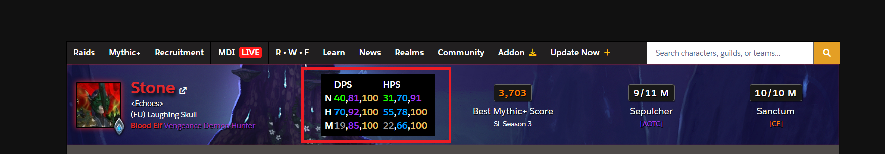
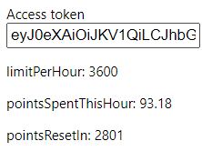

# Wclog

A chrome extension that injects a table into raider.io banner with max, average, and low DPS/HPS values from warcraftlogs.com



Open popup using chrome extension icon and add access token 



[How to get warcraft logs access token](https://www.warcraftlogs.com/api/docs)

## Issues

- Only works for US/EU servers

## Setup

```
npm install
```

## Build

```
npm run build
```

## Build in watch mode

### terminal

```
npm run watch
```

## Load extension to chrome

[Load an unpacked extension](https://developer.chrome.com/docs/extensions/mv3/getstarted/#unpacked)

Load `dist` directory


## Credits

https://github.com/chibat/chrome-extension-typescript-starter